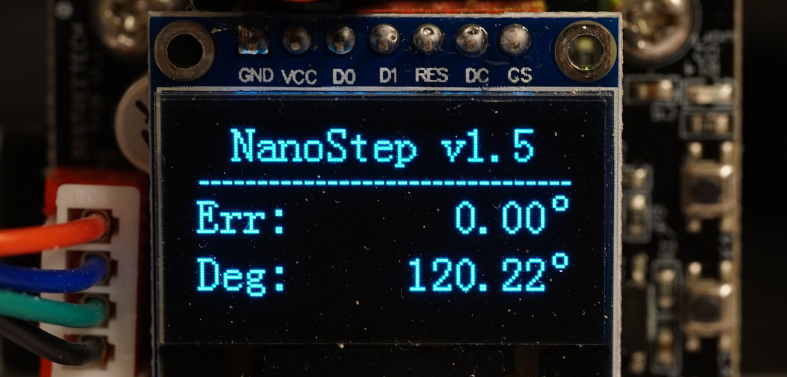
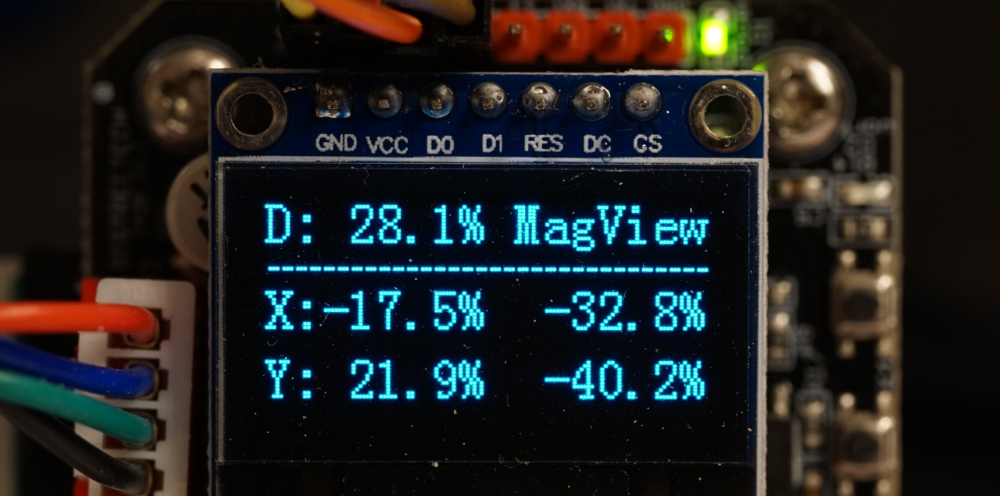

# NanoStep
This is closed loop stepper motor driver firmware for the BTT S42B-V1.0/V1.1 hardware revision. v2.0 hardware revision features different microcontroller, so this code will not work. Looking forward for pull requests to have unified codebase for V1.0 and V2.0 hardware.

My original goal was increasing angular precision of servomotor, targeting high-precision Z-axis of 3D printers (higher than intrinsic precision of stepper motor, which can have up to ~1° angular errors due to manufacturing tolerances). Second benefit of servo on Z axis is that it allows to set maximum Z axis acceleration (3000 mm/s²) without fearing missing steps: this shortens layer changes and reduces Z-seam. 

While looking through all forks of S42B I realized that they share same fundamental flaw : PID is primarily controlling effort (current), and much less care is given to positional accuracy. What happened was while error was small - current was dropping to 0. And when steps start coming in - they got missed due to too low current. Tweaking PID settings had little effect on dynamic response of S42B - and this is probably why many got quality degradation with it. 

In NanoStep approach is different: step signals are perfectly feed trough and PI controller for error is disabled for ~0.6ms (so that we don't correct transient processes, which is impossible at 30kHz loop time), and only in pauses systematic error is analyzed and corrected. This ensures that in normal operations dynamic response it identical to open loop stepper, but systematic errors are tracked and corrected. Also, previously stepper motor was considered "ground truth" for angular reading, which can only ensure no missing steps, but cannot improve precision. Now NanoStep relies on autocalibrated angle sensor (TLE5012) as ground truth. 

On Z-axis application angular errors of <0.02° are typical (yes, manufacturer rated errors for TLE5012 are higher, but these are worst case values which we should not get with autocalibration and stable environment).

Tested with no missed steps at 50kHz step signal.

## Options to flash firmware
- Using STLink programming dongle.
- Using TrueStepTerminal & USB-Serial adapter.

## Recommendations
- Attach magnet non-permanently and verify magnetic field strength, Peak field must be within 40-80% range. At <40% - sensitivity to environment & noise is higher. At >80% it is easy to saturate sensor if something changes in the future. If field is too low - you can decrease distance between magnet and sensor by removing PCB spacers or gluing magnet on plastic spacer.  Verify that angle reading is reacting to manual rotation of the motor when it is disabled. After you are satisfied with magnetic field strength - you can permanently glue it in place using 2-component epoxy. 
- 1/16 microstepping is recommended for general use. For Z axis you can use finer subdivision (32, 64), but for XY there might less opportunity for systematic error correction.
- Set current at 50-80% of manufacturer recommendation for motor to avoid excessive heat. Temperature is one of main factors effecting TLE5012 systematic errors.
- In the beginning of the print, after bed & nozzle are at final temperature - do test movement that is enough to rotate motor by 1.5 rotations or slightly more. This will autocalibrate angle sensor. 
- It is recommended to not move printer / motor during operation. Change of external magnetic field (caused by earth magnetic field or external sources) will slightly affect readings. 
- No need to set DIP switches. They are ignored and can be in any position. 
- Note that there are 256 steps per rotation, not 200. Configuration of Marlin/Klipper will need to be slightly changed.

## Troubleshooting
If angle sensor works, but closed loop control does not - there are 2 options:
- Stepper direction is incorrect. You can set PI to 0, and see if system starts to work (effectively this converts system to open loop mode). if it works in open loop, and error is increasing with rotation - swap 2 pins on the left or on the right of the motor. 
- Stepper motor pinout is incorrect. Swap 2 central pins on motor. 

## 1.8 vs 0.9° motors
NanoStep only supports 1.8° steppers, and routinely achieves <0.02° angular error thanks to effectively 1024-microstepping. 0.9° does not improve anything for closed loop operation and actually make it worse:
- Lower maximum rotation speed (as step rate is limited) 
- Smaller pauses between steps allow less time for error correction
- Less torque
- Step-2-step non-linearity is most challenging part of closed loop steppers. 0.9° motors only make it worse. 
- Easier to loose step

Therefore, I highly recommend to stick to 1.8° motors **for closed loop operation**. If these were available, I would even recommend using 3.6-7.2° motors for closed loop operation.

## Key changes
- Calibration is no longer needed. Autocalibration is enabled in TLE5012. Requires 1.5 rotation for calibration. For perfect results - you can do Z axis move in the beginning of the print. Instead of calibration there is now "Reset" which resets settings to default. 
- TLE5012 now utilizes full 15-bit resolution vs 14-bit before. FIR filter further improves results. 
- EN signal is processed in interrupt. Dramatically lower latency. 
- DIR signal latency is reduced - less code in interrupt processing. Still around 2µs latency is expected (hardware stepper drivers has around 0.2µs latency). But should be good enough. **Note, that it is no longer possible to reverse rotation direction in S42B-NanoStep settings.** This is sacrificed to reduce DIR latency. You can invert motor in Marlin/Klipper with no penalty in performance. 
- No more floating point math in control loop. Perfect fixed point math everywhere. 
- Main control loop is optimized and now runs at 30kHz vs 10kHz originally. 35-40kHz also fits, but I prefer to have some margin. 
- OLED display is >10x faster. Now we are getting reliable 10fps refresh rate.  
- DIP switches are always ignored to simplify initial configuration. Please use OLED menu or serial port for configuration. 
- Magnetic Viewer added which shows how strong is magnetic field. You should be between 40% and 80% field strength maximum. 
- No limit on error magnitude to be corrected. You can force it 5 rotations away from target - and it will return back (original version gave up after ~40° error). There could be surprises with >9 rotation errors, where both error & target positions wrap around, let's see if it causes any issues in practice. 
- Auto-restart error correction if multiple skipped steps detected (happens when trying to correct error faster than stepper motor can accelerate at configured current limit). 
- Only PI values are used for correcting positional error. D is currently ignored. PID does not affect reaction to step signals, which is always done in open loop. 
- Current is fixed, will no longer reduce automatically. If you want to run cooler - feel free to reduce current below manufacturer limit. 50% current works just fine for most uses. 
- Display always shows encoder reading - useful for debugging. 
- Screensaver will switch off display after 1 minute of inactivity (en=0 or no steps). Otherwise OLED displays degrade after ~1 year of continuous operation. 
- There is now timeout in SPI readout code for TLE5012 (there were infinite loops when waiting for new data). If random glitch will happen there - system will not hang and retry in 33µs. 

## Main UI
Err: Angular error between desired position & actual position.  
Deg: Current reading of angle sensor  

## MagView UI
**Left column:**  
D: Combined magnetic field strength (Both X & Y axis). Must always be between ~40 and ~80% for best performance.  
X, Y: Magnetic field reading from X and Y sensors. Must always be between ~40 and ~80% for best performance.  

**Right column:**  
Centering error / DC offset for X and Y axis. Must be below ~80% for best performance.  

If any reading touches 100% at any angle of the motor shaft - you must adjust magnet, as accurate angle reading is no longer impossible.  
If D in left column is below 40%, or maximum absolute value of X/Y is below 40% - noise and sensitivity to environment (temperature, external magnetic field) will be increased.  
Centering error in right column is "magnified" 16x by design of TLE5012. I.e. 100% centering error equals 6% reading on X or Y sensors in left column. Centering error below 100% is cancelled out by autocalibration. No need to push it to 0. 

## Features inherited from TrueStep
- New UART [interface](SerialInterface.md) 
  - Reduced packet overheads
  - Sequence counter to detect missing packets
  - CRC checksum
- New OLED Menu
  - Simpler navigation
  - Adjustment of PID gains

To ease configuration and to access more advanced features you can use [TrueStepTerminal](utils/TrueStepTerminal).
